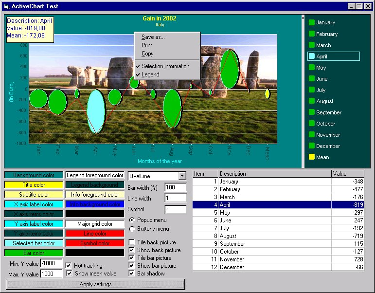



## ActiveChart \(improved\)

### Description

I worked again on this control and, as suggested, I combined several chart types. Also, I introduced the mean value to be displayed or not. I'm continuing in developing it, for example to allow series and Gantt style.

Thank you again for your interest and vote.
 
### More Info
 

             |
---                |---
**Submitted On**   |2002-07-02 14:35:20
**By**             |[mcosta68](https://github.com/Planet-Source-Code/PSCIndex/blob/master/ByAuthor/mcosta68.md)
**Level**          |Advanced
**User Rating**    |4.8 (120 globes from 25 users)
**Compatibility**  |VB 6\.0
**Category**       |[Custom Controls/ Forms/  Menus](https://github.com/Planet-Source-Code/PSCIndex/blob/master/ByCategory/custom-controls-forms-menus__1-4.md)
**World**          |[Visual Basic](https://github.com/Planet-Source-Code/PSCIndex/blob/master/ByWorld/visual-basic.md)
**Archive File**   |[ActiveChar100943722002\.zip](https://github.com/Planet-Source-Code/mcosta68-activechart-improved__1-36474/archive/master.zip)

